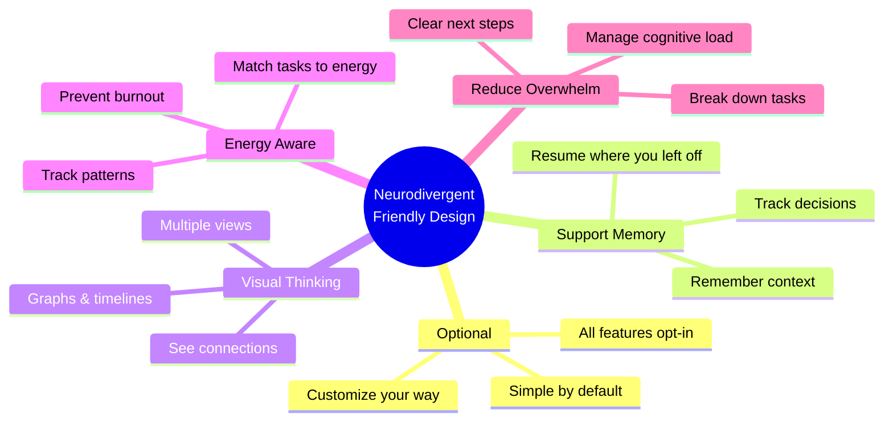
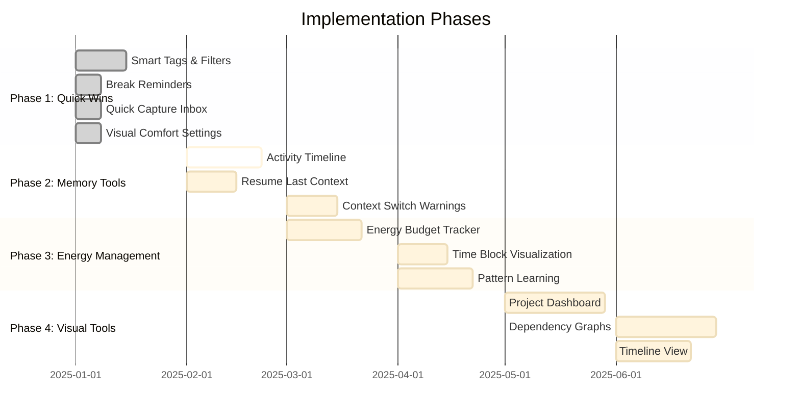
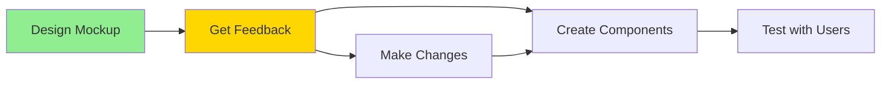
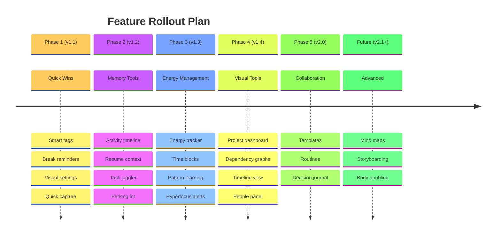
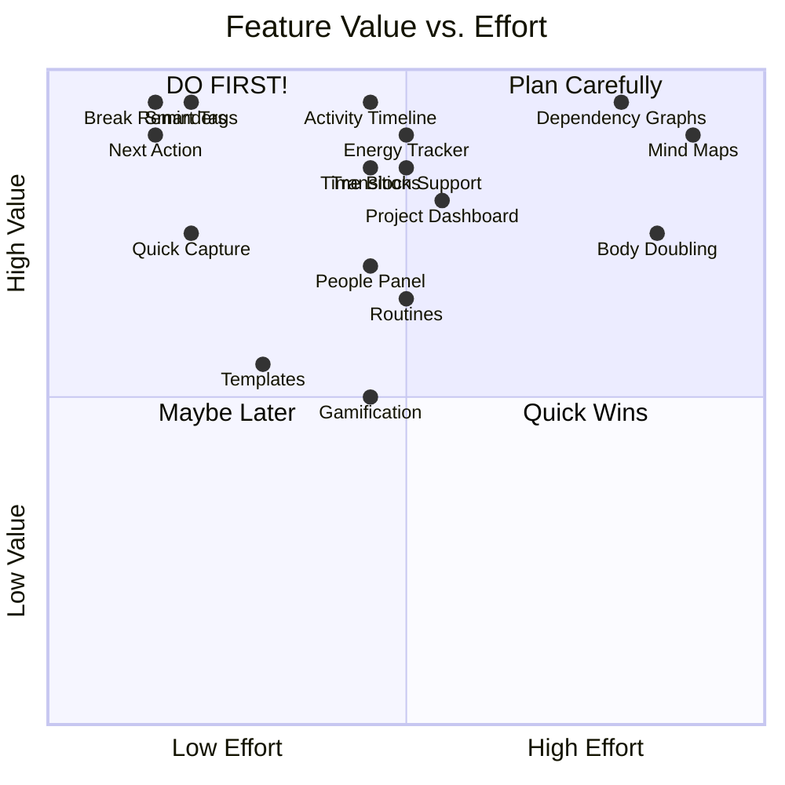

# ProjectGoat: Features for Neurodivergent Minds

**A Visual Guide to Planned Features**
*An App Designed for Neurodivergent Project Management*

---

## Our Core Values



---

## Feature Overview Map

```mermaid
graph TD
    A[ProjectGoat Features] --> B[Time & Energy]
    A --> C[Memory Support]
    A --> D[Visual Tools]
    A --> E[Focus & Breaks]
    A --> F[Organization]

    B --> B1[Time block visualization]
    B --> B2[Energy budget tracker]
    B --> B3[Spoon counter]
    B --> B4[Pattern learning]

    C --> C1[What did I do today?]
    C --> C2[Resume where I left off]
    C --> C3[Decision journal]
    C --> C4[Context switching help]

    D --> D1[Dependency graphs]
    D --> D2[Mind maps]
    D --> D3[Timeline view]
    D --> D4[Project dashboard]

    E --> E1[Break reminders]
    E --> E2[Hyperfocus protection]
    E --> E3[Transition warnings]
    E --> E4[Focus mode]

    F --> F1[Smart tags by context]
    F --> F2[Task grouping]
    F --> F3[Quick capture]
    F --> F4[Parking lot for ideas]

    style B fill:#FFE6E6
    style C fill:#E6F3FF
    style D fill:#FFF4E6
    style E fill:#E6FFE6
    style F fill:#F3E6FF
```



---

## Priority Features (What's Coming First)



---

## Feature Categories (What Each Does)

### 1. Time & Energy Management

**Why:** ADHD brains experience time differently, and energy levels fluctuate throughout the day.

**Features:**
- **Time Block Visualization**: See your day as colored blocks of time
- **Energy Budget**: Track morning/afternoon/evening energy levels
- **Spoon Theory Support**: Count your "spoons" for the day
- **Pattern Learning**: App learns when you work best

**Visual Example:**
```
Today's Energy Budget

Morning:   ⚡⚡⚡⚡⚡  (Full - best for deep work)
Afternoon: ⚡⚡⚡    (Medium - meetings OK)
Evening:   ⚡       (Low - easy tasks only)

Matched tasks for right now (Evening):
✓ Update task notes          (⚡ Low energy)
✓ Quick email responses      (⚡ Low energy)
✗ API refactoring            (⚡⚡⚡⚡ Too much!)
```

---

### 2. Memory & Context Support

**Why:** ADHD makes it hard to remember what you were doing, especially after interruptions.

**Features:**
- **Activity Timeline**: "What did I work on today?"
- **Resume Where I Left Off**: Quick button to return to your last task
- **Decision Journal**: Remember why you made certain choices
- **Context Switching Help**: Save notes before switching tasks

**Visual Example:**
```
Recent Activity
├─ 10 min ago: Edited "Design homepage"
├─ 45 min ago: Created project "Website Redesign"
├─ 2 hours ago: Completed "Review feedback"
└─ 3 hours ago: Started "Morning planning"

[Click any item to return to that context]
```

---

### 3. Visual Thinking Tools

**Why:** Many neurodivergent people think in pictures, not lists.

**Features:**
- **Dependency Graphs**: See which tasks connect to others
- **Mind Maps**: Free-form visual brainstorming
- **Timeline View**: See tasks on a calendar timeline
- **Project Dashboard**: Visual overview of project health

**Visual Example:**


---

### 4. Focus & Break Management

**Why:** ADHD hyperfocus can lead to burnout; regular breaks are essential.

**Features:**
- **Break Reminders**: Gentle nudges to take breaks
- **Hyperfocus Detection**: Notices when you've been working too long
- **Transition Warnings**: Heads up before switching contexts
- **Focus Mode**: Blocks distractions when you need deep work

**Visual Example:**
```
🔥 Hyperfocus Detected

You've been working for 3 hours straight!

Health check:
☐ Stretched recently?
☐ Had water?
☐ Rested eyes?

[Take 10-Minute Break] [I'm OK, Continue]
```

---

### 5. Organization & Chunking

**Why:** Executive dysfunction makes it hard to organize and start tasks.

**Features:**
- **Smart Tags**: Organize by context (@computer, @phone, @errands)
- **Energy Tags**: Sort by energy level needed (high/low/deep-focus)
- **Time Tags**: Quick filters (5-min tasks, 1-hour tasks)
- **Smart Filters**: Pre-made combos ("Quick Wins" = low-energy + short)
- **Task Breakdown**: Automatically suggest splitting complex tasks
- **Next Action Highlighting**: Always show what to do next

**Visual Example:**
```
View Your Tasks By:

📍 Context
   @computer (12 tasks)
   @phone (4 tasks)
   @errands (3 tasks)

⚡ Energy Level
   High energy (5 tasks)
   Medium energy (8 tasks)
   Low energy (6 tasks)

⏱️ Time Needed
   5-min quick tasks (7 tasks)
   30-min tasks (9 tasks)
   1+ hour deep work (3 tasks)
```

---

### 6. Transition & Context Switching

**Why:** Switching between tasks is cognitively expensive for ADHD brains.

**Features:**
- **Transition Cost Indicator**: Shows how different the new task is
- **Context Capture**: Save your mental state before switching
- **Hyperfocus Protection**: Pause low-priority notifications during deep work
- **Transition Rituals**: Custom pre-task routines

**Visual Example:**
```
⚠️ You're about to switch tasks

Current: Design Homepage (47 minutes)
Next:    Team Meeting

💾 Want to save your context?

Quick note: [Left off at color palette selection...]

[Save & Switch]  [Stay Here]
```

---

### 7. People & Communication

**Why:** ASD can make social/professional communication challenging.

**Features:**
- **People Panel**: Quick reference for who's involved
- **Communication Templates**: Pre-written professional messages
- **Tone Checker**: Helps ensure messages sound appropriate
- **Contact Profiles**: Remember communication preferences

**Visual Example:**
```
People on This Project
┌─────────────────┐
│ 👤 Sarah        │
│    Project Lead │
│    📧 Email OK  │
│    ✅ Responds  │
│       quickly   │
├─────────────────┤
│ 👤 Mike         │
│    Developer    │
│    💬 Prefers   │
│       Slack     │
│    ⏰ Timezone: │
│       EST       │
└─────────────────┘
```

---

### 8. Emotional Regulation

**Why:** ADHD/ASD can involve emotional dysregulation and overwhelm.

**Features:**
- **Overwhelm Detection**: Notices when you have too many active tasks
- **Frustration Detection**: Suggests breaks when you're stuck
- **Mood-Based Task Matching**: Suggests tasks that fit your current mood
- **Cognitive Load Monitor**: Warns when you're taking on too much

**Visual Example:**
```
🧠 Cognitive Load: HIGH

You currently have:
• 12 tasks marked "In Progress"
• Been working 2.5 hours straight
• 8 browser tabs open

Suggestions:
1. Pause 9 tasks (keep only 3 active)
2. Take a 10-minute break
3. Close unneeded tabs

[Auto-Simplify]  [I'm OK]
```

---

### 9. Parallel Processing Support

**Why:** ADHD brains often juggle multiple tasks simultaneously.

**Features:**
- **Task Juggler View**: See all active tasks at once
- **Quick Capture**: Instantly save thoughts without breaking flow
- **Parking Lot**: Place for ideas to deal with later

**Visual Example:**
```
🎯 Currently Active Tasks (3)

┌─────────────┐ ┌─────────────┐ ┌─────────────┐
│ Design      │ │ Write Docs  │ │ Code Review │
│ ⏱️ 47 min   │ │ ⏱️ 12 min   │ │ ⏱️ 5 min    │
│ 60% done    │ │ 20% done    │ │ 90% done    │
└─────────────┘ └─────────────┘ └─────────────┘

⚠️ Tip: Consider focusing on finishing Code Review first
```

---

### 10. Routine & Predictability

**Why:** ASD benefits from structure and knowing what to expect.

**Features:**
- **Routine Templates**: Save and reuse daily patterns
- **Daily Rhythm Templates**: Structure for entire day
- **Change Notifications**: Alerts when schedule changes unexpectedly

**Visual Example:**
```
Routine: "Monday Morning Startup"

1. ☐ Check email (10 min)
2. ☐ Review calendar (5 min)
3. ☐ Team standup (15 min)
4. ☐ Plan top 3 priorities (10 min)
5. ☐ Start deep work (2 hours)

Total time: ~2h 40min

[Apply This Routine to Today]
```

---

### 11. Sensory Comfort

**Why:** ASD sensory sensitivities affect focus and comfort.

**Features:**
- **Visual Comfort Modes**: High contrast, minimal, dark mode, grayscale
- **Reduced Motion**: Turn off animations
- **Distraction Reduction**: Hide completed tasks, minimize notifications
- **Custom Colors**: Choose color schemes that work for you

**Visual Example:**
```
Visual Comfort Settings

Theme:
○ Default (colorful)
○ Dark Mode
● High Contrast (easier to read)
○ Minimal (extremely simple)
○ Grayscale (no colors)

Motion:
☐ Animations
☑ Essential transitions only
☐ Static (no motion)

Sounds:
☑ Silent mode
☐ Success sounds
☐ Notification sounds
```

---

### 12. Motivation & Progress

**Why:** ADHD brains need immediate rewards and visible progress.

**Features:**
- **Micro-Celebrations**: Celebrate small wins
- **Progress Visualization**: See completion bars everywhere
- **Task Unlocking**: Completing tasks unlocks new ones (game-like)
- **Gamification** (Optional): Points, streaks, achievements

**Visual Example:**
```
✅ Task completed: "Write documentation"

🎉 Nice work!
⭐ Streak: 3 tasks in a row
📊 Daily progress: 40% → 60%

🔓 This unlocked:
   • Review documentation (now available)
   • Share with team (now available)
```

---

## What Gets Built When



---

## Feature Priority Matrix



---

## Key Principles

### Everything is Optional
No feature is forced on you. Turn on only what helps YOU.

### Visual by Design
Multiple ways to see your work: lists, graphs, timelines, dashboards.

### Memory Support
The app remembers so you don't have to.

### Energy Aware
Match work to your energy levels, not the other way around.

### Transition Help
Support for the hard parts: starting, switching, stopping.

### Reduce Overwhelm
Break things down, show next steps, manage cognitive load.

### No AI Required
All features work without AI. AI enhancement may come later (optional).

---

## Questions for You!

We'd love your feedback:

1. **Which features excite you most?**
2. **Which features would you actually use?**
3. **Are any features annoying or unnecessary?**
4. **What's missing that would help YOU?**
5. **Would you prefer simple mode or lots of options?**

---

## In Summary

ProjectGoat is being designed for neurodivergent minds. We want to:

- **Support executive function** (starting, organizing, remembering)
- **Work with ADHD & ASD** (not against them)
- **Reduce cognitive load** (make things easier, not harder)
- **Embrace visual thinking** (see connections and patterns)
- **Respect energy levels** (match work to capacity)
- **Make everything optional** (your brain, your choice)

**This is a tool for your brain, customized your way.**

---

*Version 1.0 - Created for community feedback*
*All features subject to change based on what actually helps people*
